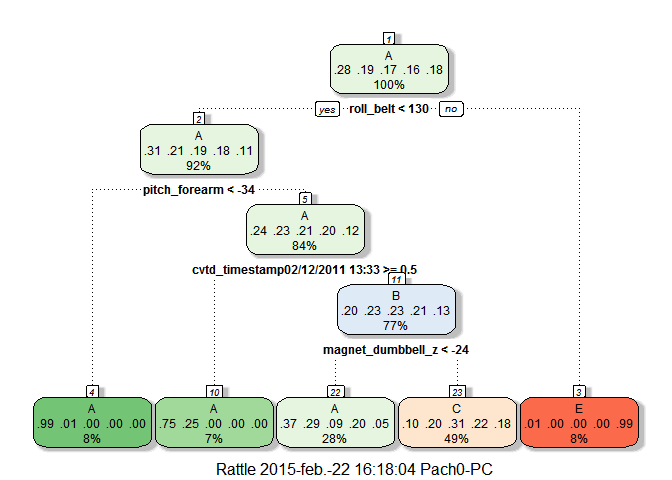

# Practical Machine Learning Project
Francisco J. Garcia R.  

# Background and introduction

Using devices such as Jawbone Up, Nike FuelBand, and Fitbit it is now possible to collect a large amount of data about personal activity relatively inexpensively. These type of devices are part of the quantified self movement - a group of enthusiasts who take measurements about themselves regularly to improve their health, to find patterns in their behavior, or because they are tech geeks. One thing that people regularly do is quantify how much of a particular activity they do, but they rarely quantify how well they do it. In this project, your goal will be to use data from accelerometers on the belt, forearm, arm, and dumbell of 6 participants. They were asked to perform barbell lifts correctly and incorrectly in 5 different ways. More information is available from the website here: http://groupware.les.inf.puc-rio.br/har (see the section on the Weight Lifting Exercise Dataset). 

#Code book

- Original data:

Velloso, E.; Bulling, A.; Gellersen, H.; Ugulino, W.; Fuks, H. Qualitative Activity Recognition of Weight Lifting Exercises. Proceedings of 4th International Conference in Cooperation with SIGCHI (Augmented Human '13) . Stuttgart, Germany: ACM SIGCHI, 2013.
Links to Raw Data

- The training data for this project are available here:

https://d396qusza40orc.cloudfront.net/predmachlearn/pml-training.csv

- The test data are available here:

https://d396qusza40orc.cloudfront.net/predmachlearn/pml-testing.csv
Background

#Libraries and prerequisites

This section load all prerequisites and libraries which will be used for the project


```r
library(ggplot2)
library(caret)
```

```
## Warning: package 'caret' was built under R version 3.1.2
```

```
## Loading required package: lattice
```

```r
library(rpart)
library(e1071)
```

```
## Warning: package 'e1071' was built under R version 3.1.2
```

```r
library(rattle)
```

```
## Warning: package 'rattle' was built under R version 3.1.2
```

```
## Rattle: A free graphical interface for data mining with R.
## Versión 3.4.1 Copyright (c) 2006-2014 Togaware Pty Ltd.
## Escriba 'rattle()' para agitar, sacudir y  rotar sus datos.
```

```r
library(rpart)
```

#Getting and cleaning data

This section download the training and testing files, and perform a basic cleaning of the data, focus on remove useless information


```r
#download.file ("https://d396qusza40orc.cloudfront.net/predmachlearn/pml-training.csv", 
#              destfile = "pml-training.csv")
#download.file("https://d396qusza40orc.cloudfront.net/predmachlearn/pml-testing.csv", 
#              destfile = "pml-testing.csv")

trainRaw <- read.csv("pml-training.csv")
testRaw  <- read.csv("pml-testing.csv")

trainRaw$X      <- NULL
trainRaw.clean  <- trainRaw[,colSums(is.na(trainRaw)) < .5 * nrow(trainRaw)]

testRaw$X       <- NULL
testRaw.clean   <- testRaw[,colSums(is.na(testRaw)) < .5 * nrow(testRaw)]

TraininSetClean <- trainRaw.clean[,colnames(trainRaw.clean) %in% colnames(testRaw.clean)]
TraininSetClean$classe <- trainRaw.clean$classe
```

#Split data: Testing and training data sets

Now, with the clean data, We are going to split the training set into training and testing dataset, in order to compute the models and perform a cross-validation. 


```r
inTrain <- createDataPartition(TraininSetClean$classe, p=0.65, list=FALSE)
TrainingSet <- TraininSetClean[inTrain,]
TestSet  <- TraininSetClean[-inTrain,]
```

#Training models

We are going to fit 3 different models, in order to choose the best accuracy and performance for our dataset, the model that will be used, are:

1. Boosting
2. Classification Decision Trees
3. Random Forest

All of them are taken from the caret package.


```r
# Using Boosting
ModelBoosting <- train(classe ~ ., method="gbm", data=TrainingSet, verbose=FALSE)

# Using rpart for Classification Desicision Trees
ModelDescTree <- train(classe ~ . ,method = "rpart", data=TrainingSet )

# Using Random Forest 
ModelRandomForest <-train(classe~., data=TrainingSet, method="rf", prox=TRUE)
```

#Testing and cross-validation

After fit three different models, we are going to evaluate and perform a cross-validation of each model, in order to select the best approach for testing purposes.

First, we get the confusion matrix of each model, and a small review of the accuracy in the Overall Statistics summary.

after that, we resampling randomly for 10 times and apply the same models to each set of samples.

**This process is very computationally expensive, so, we exclude this piece of code from this article.**

At the end, we average the results for each group of samples in order to determine the best model for this project.


```r
PredictionModelBoosting <- predict(ModelBoosting, TestSet, type = "class")
confusionMatrix(pred.rpart, TestSet$classe)

PredictionModelDescTree <- predict(ModelDescTree, TestSet)
confusionMatrix(PredictionModelDescTree, TestSet$classe)

PredictionModelRandomForest <- predict(ModelRandomForest, TestSet)
confusionMatrix(ModelRandomForest, TestSet$classe)
```

#Visualization

Finally, we show the results of each model throughout the function "fancyRpartPlot" which help us to understand in a better way the accuracy of each model.


```r
fancyRpartPlot(PredictionModelBoosting)
fancyRpartPlot(PredictionModelDescTree)
fancyRpartPlot(PredictionModelRandomForest)
```

#Conclusion

The cross-validation process are very useful and allow to adjust the model to better values of accuracy. We try to apply different algorithm in order to improve the final results and determine the advantages and disadvantages in each of them.

Due to computational reasons, we exclude in this article a part of the process and we show just the worse result in model fitting, the rest of the graphics was excluded.


```r
# Using rpart for Classification Desicision Trees
ModelDescTree <- train(classe ~ . ,method = "rpart", data=TrainingSet )
PredictionModelDescTree <- predict(ModelDescTree, TestSet)
confusionMatrix(PredictionModelDescTree, TestSet$classe)
```

```
## Confusion Matrix and Statistics
## 
##           Reference
## Prediction    A    B    C    D    E
##          A 1602  691  196  395   95
##          B    0    0    0    0    0
##          C  349  637 1001  730  591
##          D    0    0    0    0    0
##          E    2    0    0    0  576
## 
## Overall Statistics
##                                          
##                Accuracy : 0.4631         
##                  95% CI : (0.4512, 0.475)
##     No Information Rate : 0.2845         
##     P-Value [Acc > NIR] : < 2.2e-16      
##                                          
##                   Kappa : 0.309          
##  Mcnemar's Test P-Value : NA             
## 
## Statistics by Class:
## 
##                      Class: A Class: B Class: C Class: D Class: E
## Sensitivity            0.8203   0.0000   0.8363   0.0000   0.4564
## Specificity            0.7197   1.0000   0.5930   1.0000   0.9996
## Pos Pred Value         0.5378      NaN   0.3026      NaN   0.9965
## Neg Pred Value         0.9097   0.8066   0.9449   0.8361   0.8909
## Prevalence             0.2845   0.1934   0.1744   0.1639   0.1838
## Detection Rate         0.2334   0.0000   0.1458   0.0000   0.0839
## Detection Prevalence   0.4339   0.0000   0.4819   0.0000   0.0842
## Balanced Accuracy      0.7700   0.5000   0.7146   0.5000   0.7280
```

```r
fancyRpartPlot(ModelDescTree$finalModel)
```

 

#System information for reproducibility


```r
Sys.info()
```

```
##        sysname        release        version       nodename        machine 
##      "Windows"        "7 x64"   "build 9200"        "PACH0"       "x86-64" 
##          login           user effective_user 
##     "Pach0-PC"     "Pach0-PC"     "Pach0-PC"
```

```r
sessionInfo()
```

```
## R version 3.1.0 (2014-04-10)
## Platform: x86_64-w64-mingw32/x64 (64-bit)
## 
## locale:
## [1] LC_COLLATE=Spanish_Colombia.1252  LC_CTYPE=Spanish_Colombia.1252   
## [3] LC_MONETARY=Spanish_Colombia.1252 LC_NUMERIC=C                     
## [5] LC_TIME=Spanish_Colombia.1252    
## 
## attached base packages:
## [1] stats     graphics  grDevices utils     datasets  methods   base     
## 
## other attached packages:
## [1] rattle_3.4.1    e1071_1.6-4     rpart_4.1-8     caret_6.0-41   
## [5] lattice_0.20-29 ggplot2_1.0.0  
## 
## loaded via a namespace (and not attached):
##  [1] BradleyTerry2_1.0-6 brglm_0.5-9         car_2.0-24         
##  [4] class_7.3-10        codetools_0.2-8     colorspace_1.2-4   
##  [7] compiler_3.1.0      digest_0.6.8        evaluate_0.5.5     
## [10] foreach_1.4.2       formatR_1.0         grid_3.1.0         
## [13] gtable_0.1.2        gtools_3.4.1        htmltools_0.2.6    
## [16] iterators_1.0.7     knitr_1.9           lme4_1.1-7         
## [19] MASS_7.3-31         Matrix_1.1-3        mgcv_1.7-29        
## [22] minqa_1.2.4         munsell_0.4.2       nlme_3.1-117       
## [25] nloptr_1.0.4        nnet_7.3-8          parallel_3.1.0     
## [28] pbkrtest_0.4-2      plyr_1.8.1          proto_0.3-10       
## [31] quantreg_5.11       RColorBrewer_1.1-2  Rcpp_0.11.4        
## [34] reshape2_1.4.1      rmarkdown_0.5.1     rpart.plot_1.5.2   
## [37] scales_0.2.4        SparseM_1.6         splines_3.1.0      
## [40] stringr_0.6.2       tools_3.1.0         yaml_2.1.13
```


